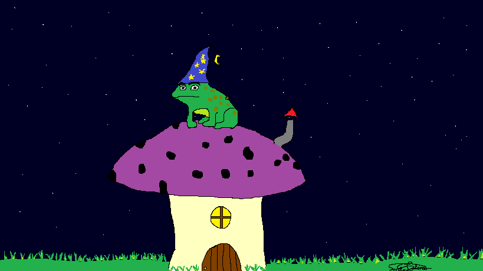

<!DOCTYPE html>
<html lang="en-US">
 <head>
  <meta charset="utf-8">
  <meta name="viewport" content="widht=device-width">
 </head>
  <body>
  <ul>
  <li>Home</li>
  <li><a href="Pictures.html">Suas fotos</a></li>
  <li><a href="Projects.html">Sobre o que se trata</a></li>
  <li><a href="Social">Social</a></li>
  </ul>
   <h1>Página inicial</h1>

Seja bem-vinde ao<a
    href="Links/Index.html"
    title="A página inicial do projeto da Sorcha"> projeto da Sorcha

  </a>
    
   
Afim de se comunicar comigo? Mande um email para <a href="mailto:sorchagalera@gmail.com">Sorcha</a> :)

  </body>
</html>
